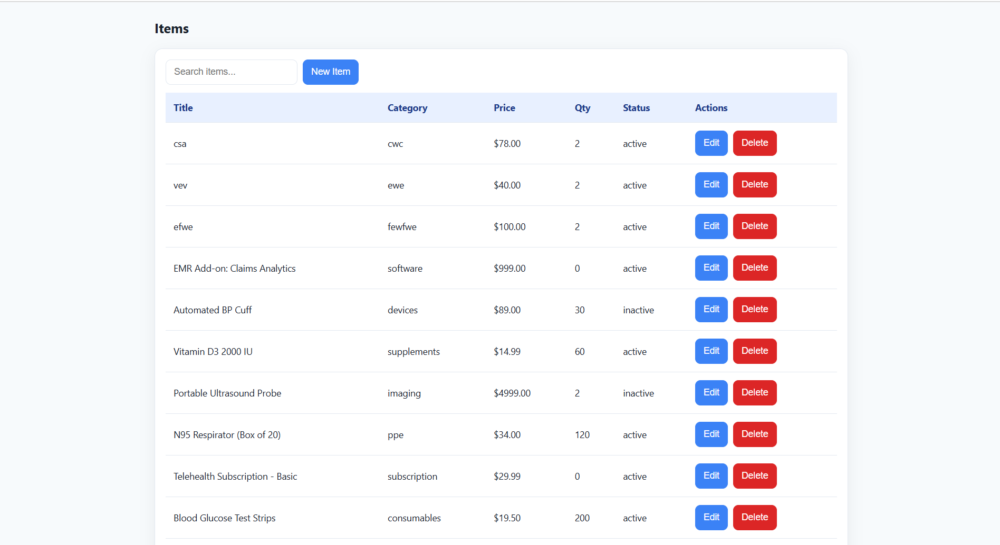
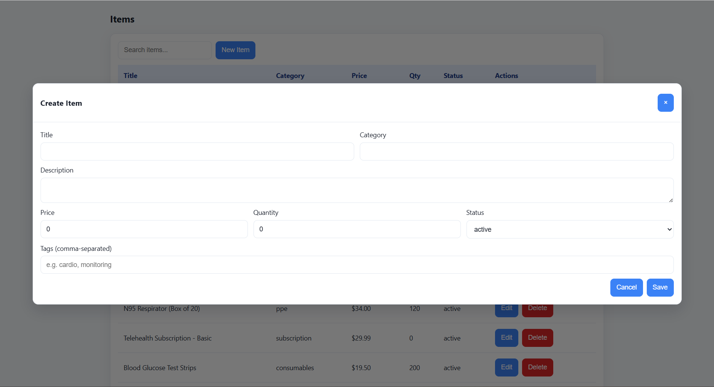
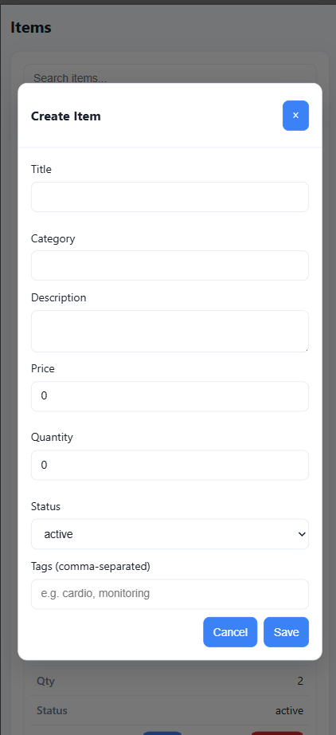

# XYRIC Frontend

A responsive React + TypeScript frontend for the Real-Time Item Management System.

## Assignment Overview
 
**Goal:** Build a real-time item management UI with CRUD, search, pagination, and robust validation.

---

## Features

- **Items List:** Table view with item details (title, category, price, quantity, status).
- **CRUD Operations:** Create, edit, and delete items via modal forms.
- **Real-Time Search:** Search input with 300ms debounce and loading indicator.
- **Pagination:** Page navigation, page size selection, and total count display.
- **Validation:** All forms use Zod for client-side validation.
- **Toasts:** Success/error notifications for all actions.
- **Responsive UI:** Mobile-friendly layout and controls.
- **API Integration:** Connects to a RESTful backend (see [backend/README.md](../backend/README.md)).

---

## Setup

1. **Copy environment file:**

   ```powershell
   Copy-Item .env.example .env
   ```

2. **Install dependencies:**

   ```bash
   npm install
   ```

3. **Run the development server:**

   ```bash
   npm run dev
   ```

   - Open [http://localhost:5173](http://localhost:5173) in your browser.
   - Configure backend API URL via `VITE_API_BASE` in `.env`.

---

## Project Structure

```
frontend/
  ├── .env
  ├── index.html
  ├── package.json
  ├── tsconfig.json
  └── src/
      ├── App.tsx            # Main app layout
      ├── main.tsx           # Entry point
      ├── styles.css         # Global styles
      ├── components/
      │   └── Toast.tsx      # Toast notifications
      └── items/
          ├── api.ts         # API calls & types
          ├── ItemForm.tsx   # Create/Edit form
          └── ItemsPage.tsx  # Items list, search, pagination
```

---

## Core Components

- **[src/items/ItemsPage.tsx](src/items/ItemsPage.tsx):**  
  Main page for listing, searching, paginating, and managing items.

- **[src/items/ItemForm.tsx](src/items/ItemForm.tsx):**  
  Modal form for creating and editing items, with Zod validation.

- **[src/items/api.ts](src/items/api.ts):**  
  TypeScript API client for CRUD operations and type definitions.

- **[src/components/Toast.tsx](src/components/Toast.tsx):**  
  Toast notifications for user feedback.

---

## API Integration

- **Base URL:** Configured via `VITE_API_BASE` in `.env` (default: `http://localhost:4000`)
- **Endpoints Used:**
  - `GET /api/items` — List/search items (with pagination)
  - `POST /api/items` — Create item
  - `PUT /api/items/:id` — Update item
  - `DELETE /api/items/:id` — Delete item

---

## Validation

- All forms use [Zod](https://zod.dev/) schemas for input validation.
- Errors are displayed inline next to fields.

---

## Assignment Requirements Mapping

| Requirement                 | Implementation Location                                                                                |
| --------------------------- | ------------------------------------------------------------------------------------------------------ |
| CRUD operations             | [src/items/api.ts](src/items/api.ts), [src/items/ItemsPage.tsx](src/items/ItemsPage.tsx)               |
| Real-time search (debounce) | [src/items/ItemsPage.tsx](src/items/ItemsPage.tsx) (`useDebouncedValue`)                               |
| Pagination                  | [src/items/ItemsPage.tsx](src/items/ItemsPage.tsx)                                                     |
| Responsive UI               | [src/styles.css](src/styles.css), [src/App.tsx](src/App.tsx)                                           |
| Error handling & validation | [src/items/ItemForm.tsx](src/items/ItemForm.tsx), [src/components/Toast.tsx](src/components/Toast.tsx) |

---

## Notes

- Backend API must be running and accessible at the URL set in `.env`.
- For backend setup and API details, see [backend/README.md](../backend/README.md).

---

## Screenshots

## Screenshots

| Items List (Desktop)                   | Item Form (Validation)                     | Responsive (Mobile)                                     |
| -------------------------------------- | ------------------------------------------ | ------------------------------------------------------- |
|  |  |  |
